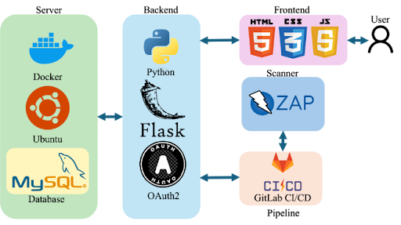

# Architecture



## Overview

Vulnerability Detect and Analysis is a Flask application backed by MySQL that orchestrates
OWASP ZAP scans through GitHub Actions and presents the results in a role-based dashboard.

```
User (browser)
    │  HTTPS
    ▼
Flask app (gunicorn)
    ├── Auth: session login + Google OAuth, per-user API keys, RBAC
    ├── Dashboard / reports / trends  ── reads ──►  MySQL
    ├── Scheduler thread  ── due scans ──►  scan backend
    └── Scan backend (utility.py)
           │  validate target (scan_guard) → workflow_dispatch
           ▼
        GitHub Actions  ──runs──►  OWASP ZAP baseline
           │  uploads artifact (scan.json / report)
           ▼
        App polls run → downloads artifact → parse (scan_parse) → MySQL
```

## Components

| Component | Responsibility |
|---|---|
| `app.py` | Entry point; builds the app, runs gunicorn in prod / dev server locally |
| `flask_app/__init__.py` | App factory: config from env, secure cookies, headers, ProxyFix, scheduler |
| `flask_app/routes.py` | All HTTP routes: pages, REST API, auth, dashboard/report/trend data |
| `utility.py` | Scan backend — dispatches GitHub Actions, polls runs, ingests artifacts |
| `flask_app/scan_guard.py` | Target validation (SSRF guard), allowlist, per-user cooldown |
| `flask_app/scan_parse.py` | Parses ZAP `scan.json` into counts + vulnerability records |
| `flask_app/scheduler.py` | Background thread that runs scheduled scans |
| `flask_app/utils/database/database.py` | MySQL access + password/session crypto |
| `.github/workflows/zap-scan.yml` | OWASP ZAP baseline scan, triggered via `workflow_dispatch` |
| `schema.sql` / `seed_demo.py` | Schema creation and synthetic demo data |

## Data flow for a scan

1. A user (owner/admin or allowlisted demo user) triggers a scan for a registered website.
2. `scan_guard.validate_target` rejects unsafe URLs; the allowlist restricts demo users.
3. `utility.run_scan` inserts a `scans` row and dispatches `zap-scan.yml` with the target
   and the new `scan_id` (encoded in the run name for correlation).
4. GitHub Actions runs the ZAP baseline scan and uploads the report as an artifact.
5. On dashboard/report views, the app polls in-flight runs; when a run succeeds it
   downloads the artifact, parses it, and writes `scans` counts + `vulnerabilities` +
   `scanned_websites` to MySQL.
6. The dashboard, reports, and trend endpoints read exclusively from MySQL.

## Storage model

Raw scan artifacts are **not** relied upon on the local filesystem (deploy hosts are
ephemeral). Parsed summaries and per-vulnerability records are persisted in MySQL:

- `scans` — one row per scan (status, risk counts, GitHub run id in `pipeline_id`).
- `vulnerabilities` — per-finding detail (name, severity, description, solution, count).
- `scanned_websites` — discovered URLs per scan.
- `users`, `websites`, `website_auth`, `domains` — accounts, sites, sharing, OAuth domains.
- `schedules`, `scan_times`, `valid_days`, `hourly_frequency`, `monthly_date` — scheduling.

## Migration note (GitLab → GitHub)

The original capstone triggered scans via MSU GitLab CI and stored the GitLab pipeline id
in `scans.pipeline_id`. This version dispatches GitHub Actions instead and reuses
`pipeline_id` to store the **GitHub run id** (widened to `BIGINT`). `report_url` holds the
Actions run URL. No other schema changes were required.
