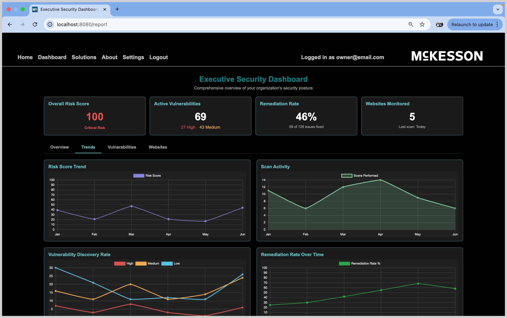
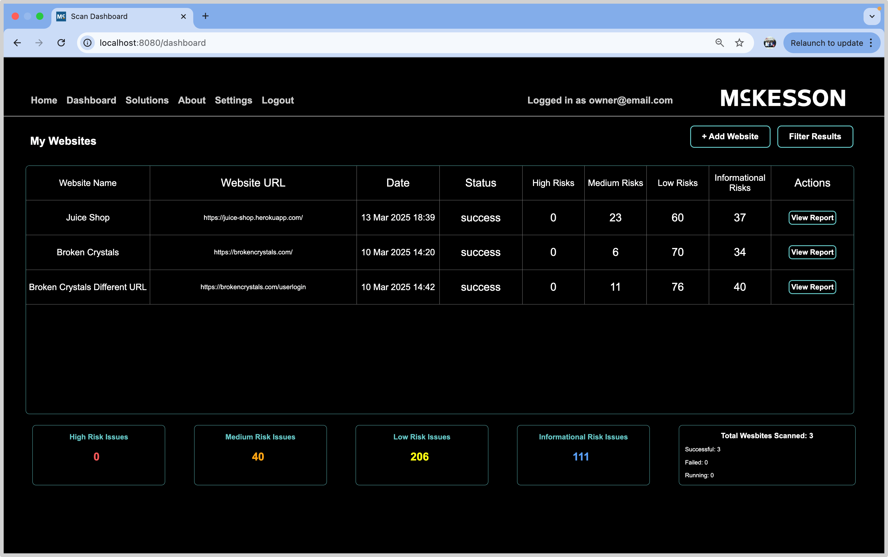
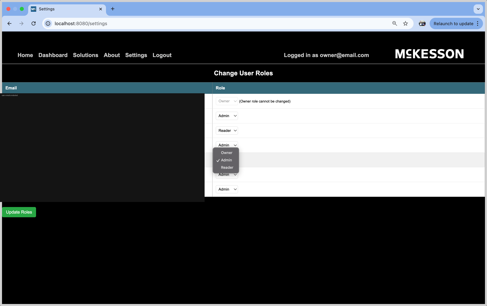

# Vulnerability Detect and Analysis

A web application security platform that automates **OWASP ZAP** scans, parses the
results, and presents vulnerabilities through an interactive, role-based dashboard.

> **Project video:** https://www.youtube.com/watch?v=YUtp3JlNoGM

---

## Demo logins

The deployed demo seeds four roles (passwords are configurable via environment variables):

| Role     | Email                  | Password (default)   | Can do |
|----------|------------------------|----------------------|--------|
| Owner    | `owner@demo.local`     | `demo-owner-pass`    | Everything, incl. user role management |
| Admin    | `admin@demo.local`     | `demo-admin-pass`    | Manage websites, scans, schedules, most users |
| Employee | `employee@demo.local`  | `demo-employee-pass` | Run scans / view reports for shared sites |
| Reader   | `reader@demo.local`    | `demo-reader-pass`   | View-only access to shared sites |

Log in at `/login` (no Google account required). Google OAuth is also supported.

> **Demo safety:** demo users can only launch real scans against an allowlist of
> intentionally-vulnerable test targets (Juice Shop, Broken Crystals, etc.).

---

## Screenshots

| Executive dashboard | Scan dashboard | Role management |
|---|---|---|
|  |  |  |

### Architecture


---

## Features

- **OWASP ZAP scan automation** via a GitHub Actions pipeline
- **Vulnerability dashboard** with risk summary (high / medium / low / informational)
- **Scan history** and per-scan **report views** with trends & remediation comparison
- **Role-based access control** (owner / admin / employee / reader)
- **Scheduled scans** (hourly / daily / weekly / monthly)
- **REST API** with per-user API keys
- **MySQL persistence** of parsed scan summaries and vulnerability records
- **Dockerized** local development and deployment
- **Safe public-demo mode**: scan-target allowlist, SSRF protections, per-user cooldown

## Tech stack

Flask · MySQL · Docker / Docker Compose · GitHub Actions · OWASP ZAP ·
HTML / CSS / JavaScript · Chart.js · Google OAuth (Authlib) · Gunicorn

---

## Project origin

> Originally developed as a Michigan State University capstone project sponsored by
> McKesson. This public portfolio version was cleaned, secured, documented, and
> prepared for deployment by Christopher Nguyen.

### What I improved for public deployment

- Removed all checked-in secrets and moved configuration to environment variables
- Replaced the MSU **GitLab CI** scanner dependency with **GitHub Actions**
- Migrated scan automation to a lazy-initialized backend (no network calls at import,
  so the app boots anywhere)
- Cleaned up Docker / local-dev setup (slim image, non-root, no secrets in the image)
- Added deployment docs (`DEPLOYMENT.md`, `SECURITY.md`, `ARCHITECTURE.md`)
- Added a demo login flow with seeded, synthetic demo data
- Added safe scan-target controls (allowlist + SSRF validation + cooldown)
- Dropped unused SocketIO/eventlet and modernized to Python 3.12

---

## Run it locally (Docker)

Requirements: Docker + Docker Compose.

```bash
cp .env.example .env       # then edit values (generate FLASK_SECRET_KEY + FERNET_KEY)
docker compose up --build
```

Open <http://localhost:8080> and log in with a demo account above. The stack starts
MySQL, creates the schema, seeds demo data, and serves the app automatically.

Generate the two required secrets:

```bash
python -c "import secrets; print('FLASK_SECRET_KEY=' + secrets.token_hex(32))"
python -c "from cryptography.fernet import Fernet; print('FERNET_KEY=' + Fernet.generate_key().decode())"
```

## Deploy it

See **[DEPLOYMENT.md](DEPLOYMENT.md)** for a free-tier path (Render web service +
Aiven MySQL + GitHub Actions for scanning), Google OAuth setup, and verification steps.

---

## Environment variables

| Variable | Required | Description |
|---|---|---|
| `FLASK_SECRET_KEY` | yes (prod) | Flask session signing key |
| `FLASK_ENV` | no | `production` (default) or `development` |
| `PORT` | no | Web server port (default `8080`) |
| `MYSQL_HOST` / `MYSQL_PORT` | yes | Database host / port |
| `MYSQL_USER` / `MYSQL_PASSWORD` | yes | Database credentials |
| `MYSQL_DATABASE` | yes | Database name |
| `DOCKER_ENV` | no | `true` inside containers (skips `.env` file loading) |
| `FERNET_KEY` | yes (prod) | Key for reversible session-email encryption |
| `PASSWORD_SALT` | recommended | Salt for one-way password/api-key hashing |
| `OAUTH_ID` / `OAUTH_SECRET` | no | Google OAuth client (login works without it) |
| `GITHUB_TOKEN` | no | Fine-grained PAT (Actions read/write) for live scans |
| `GITHUB_OWNER` / `GITHUB_REPO` | no | Repo that hosts the scan workflow |
| `GITHUB_WORKFLOW_FILE` | no | Workflow file name (default `zap-scan.yml`) |
| `GITHUB_REF` | no | Git ref to run the workflow on (default `main`) |
| `DEMO_MODE` | no | Enables demo seeding / restrictions |
| `DEMO_*_PASSWORD` | no | Per-role demo passwords |
| `SCAN_ALLOWLIST` | no | Comma-separated hosts demo users may scan |
| `SCAN_COOLDOWN_SECONDS` | no | Minimum seconds between scans per user |

Full template: [`.env.example`](.env.example).

---

## Known limitations (free tier)

- Free web hosts **spin down when idle** — the first request after a pause is slow.
- Free hosts have an **ephemeral filesystem**: parsed results live in MySQL, but raw
  scan artifacts are not persisted on disk between deploys.
- Managed free MySQL has **storage limits**; the demo dataset is intentionally small.
- GitHub Actions has **artifact retention / minute limits** on free accounts.
- Live scans are **best-effort** in the demo; the dashboard is populated from seeded data.

## Ethical scanning notice

**Only scan systems you own or have explicit permission to test.** This project ships
with SSRF protections and a demo allowlist, but you are responsible for how you use it.
See [SECURITY.md](SECURITY.md).
